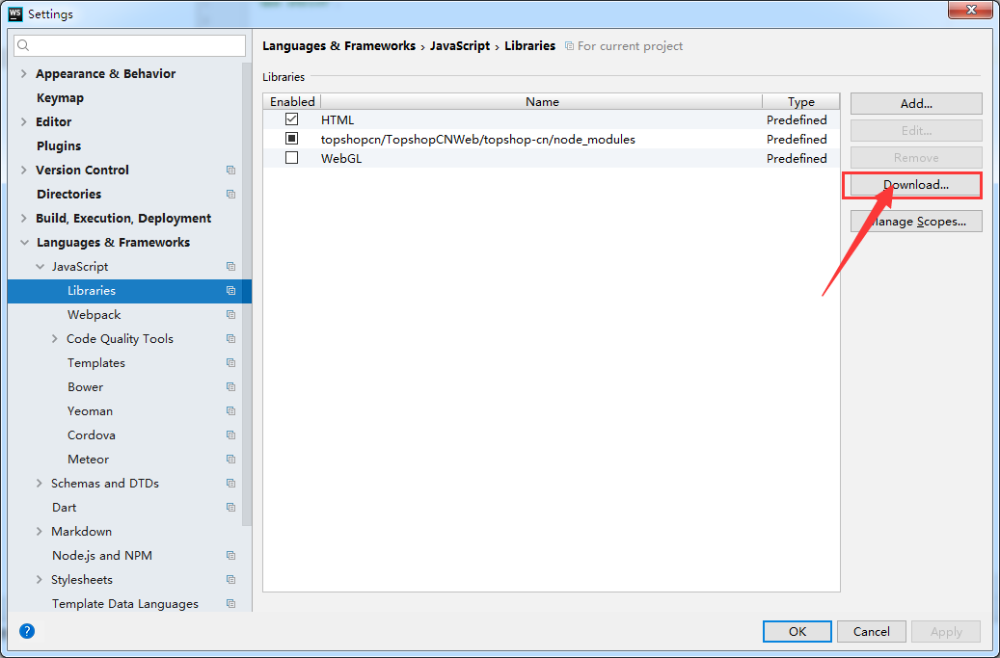
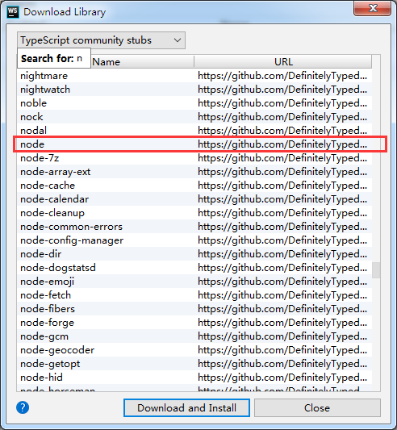
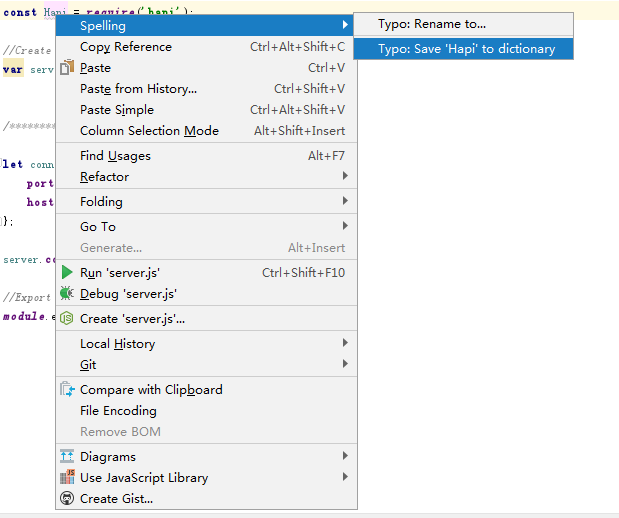
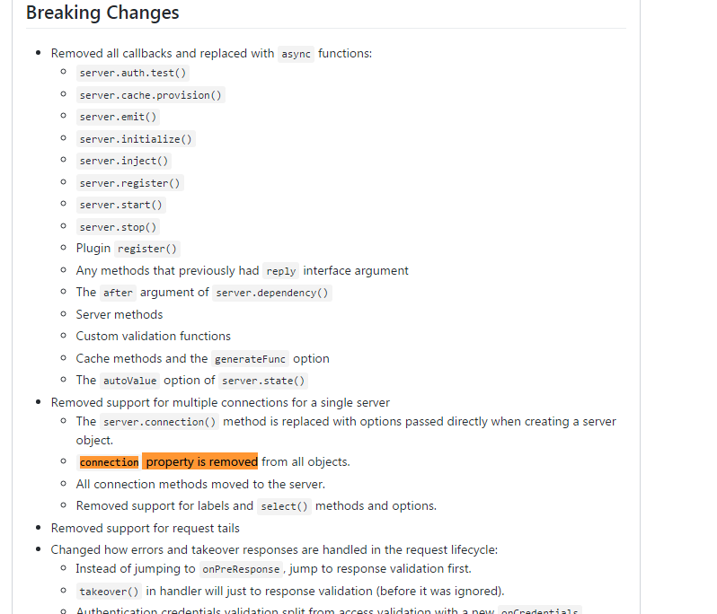

### 一些小错误

> 1. 在webstrom中有一些函数不能识别，如：require等 ，如下两部来解决即可

	

> 2.webstrom中拼写错误/不识别英文单词，给波浪线提示

彻底取消的[参见](http://blog.csdn.net/miyuehu/article/details/44154963)File----Settings-----Editor-----Inspections----Spelling----Typo

> 3.npm start启动后出错：

server.connection(connectionOption);
       ^

TypeError: server.connection is not a function
    at Object.<anonymous> (E:\workspace\topshopcn\projectname\server.js:16:8)
    at Module._compile (module.js:635:30)
    at Object.Module._extensions..js (module.js:646:10)
    at Module.load (module.js:554:32)
    at tryModuleLoad (module.js:497:12)
    at Function.Module._load (module.js:489:3)
    at Module.require (module.js:579:17)
    at require (internal/module.js:11:18)
    at Object.<anonymous> (E:\workspace\topshopcn\projectname\app.js:3:16)
    at Module._compile (module.js:635:30)
npm ERR! code ELIFECYCLE
npm ERR! errno 1
npm ERR! projectname@1.0.0 start: `node app.js`
npm ERR! Exit status 1
npm ERR!
npm ERR! Failed at the projectname@1.0.0 start script.
npm ERR! This is probably not a problem with npm. There is likely additional logging output above.

npm ERR! A complete log of this run can be found in:
npm ERR!     C:\Users\Administrator\AppData\Roaming\npm-cache\_logs\2017-11-29T02_01_32_627Z-debug.log
	
**慎重尝试，可能导致npm不好使，需要重装nodejs**

~~这个错误需要重装npm!!!
推荐使用淘宝npm镜像~~ 	

	~~	$npm install -g cnpm --registry=https://registry.npm.taobao.org~~

~~安装cnpm后，运行 <code>$cnpm install</code>~~

最后发现<code>server.connection is not a function</code>这个方法Hapi已经不用了[#3658](https://github.com/hapijs/hapi/issues/3658)

> 4. 按照Hapi搭建起来的项目，用npm start 运行，出现
	
	{
	    "statusCode": 400,
	    "error": "Bad Request",
	    "message": "Invalid cookie value"
	}

错误，这个应该是Hapi的Bug，好像一直没解决了。这里有官方关于这个问题的[解决方式](https://hapijs.com/tutorials/cookies?lang=en_US)，但是我试了不好用。

最后用了一个比较土鳖的解决办法,在route里面添加config配置（也许有更好的，但是没有找到，先这么解决）。

	server.route({
	    method: 'GET',
	    path: '/',
		/********添加config配置***************/
	    config:{
			// If an error occurs when parsing a cookie don't error, just log it.
	        state:{
	         failAction : 'log',
	        }
	    },
	    handler: function (request, reply) {
	        reply('Hello, world!');
	    }
	});	

> 5.开源的架构老是更新，hapi 17.0的修改变动太大了，参考下面的进行配置

	https://github.com/zeit/next.js/blob/b8e376a13f8bb03df4bad209d0db705ec3d2f3bf/examples/custom-server-hapi/server.js	

	
	
	
	